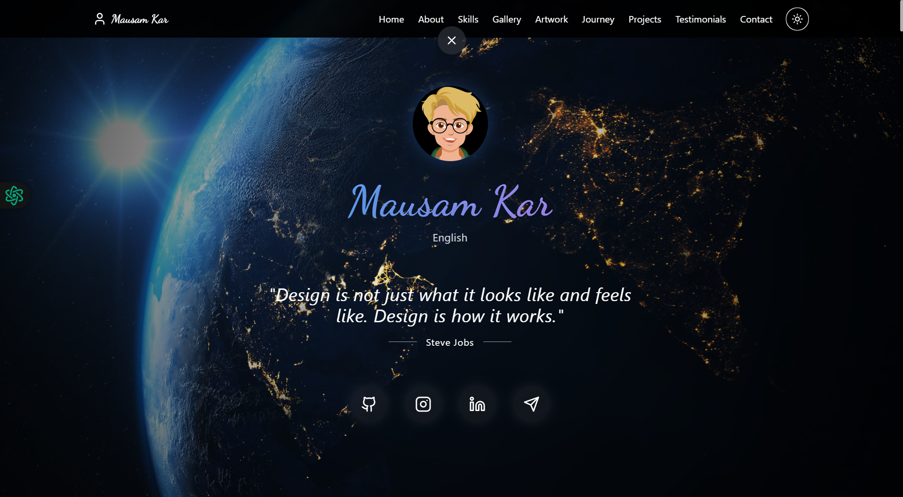

# My Portfolio (Version 3)




## 📌 Table of Contents

- [Introduction](#-introduction)
- [Tech Stack](#-tech-stack)
- [Sections Included](#-sections-included)
- [Live Demo](#-live-demo)
- [Installation & Setup](#-installation--setup)
- [Contact Me](#-contact-me)

## 🌟 Introduction
Welcome to Version 3 of my personal portfolio! This is the most refined, interactive, and visually engaging version yet, designed to offer a seamless and immersive experience. Featuring a fully responsive UI, smooth transitions, and dynamic animations, this portfolio ensures adaptability across all devices. With a built-in dark mode and light mode toggle, users can personalize their viewing experience with ease.

## 🛠️ Tech Stack
This portfolio leverages modern technologies to deliver high performance, fluid interactivity, and an aesthetically captivating UI. Below are the core technologies used:

### **Frontend Technologies:**
✅ ReactJS – A fast and efficient JavaScript library for building dynamic UI  
✅ TypeScript – Ensuring type safety and improved code maintainability  
✅ JavaScript – Powering interactive elements with optimized logic  

### **Styling & Animations:**
✅ Tailwind CSS – Utility-first styling for rapid and responsive UI development  
✅ Framer Motion – Enabling stunning animations and transitions  
✅ Custom CSS – Fine-tuned styles to create a unique and engaging design  

### **Deployment & Hosting:**
✅ Vercel – High-speed global deployment ensuring minimal latency  

### **Other Integrations:**
✅ Telegram – Direct communication channel for quick interactions  
✅ GitHub API – Live fetching of repository contributions and latest projects  

## 📂 Sections Included
This portfolio is structured into multiple sections, each thoughtfully designed to showcase my skills, achievements, experiences, and aspirations:

✅ **Hero Section** – A visually captivating introduction with engaging animations.  
✅ **About Me Section** – A detailed insight into my journey, passions, and interests.  
✅ **Qualification Section** – A well-organized display of my professional qualifications and expertise.  
✅ **Certification Section** – A showcase of my earned certificates, reflecting my dedication to learning.  
✅ **Skills Section** – An interactive section highlighting my technical skills with dynamic hover effects.  
✅ **Education Section** – A timeline representation of my academic journey.  
✅ **Notes Section** – A curated space documenting key learnings and insights.  
✅ **Gallery Section** – A collection of memorable moments and creative photographs.  
✅ **Artwork Section** – A showcase of my artistic creations, including paintings and digital artwork.  
✅ **Journey Section** – A structured timeline detailing my personal and professional milestones.  
✅ **Inspirations Section** – A dedicated section highlighting mentors and role models.  
✅ **Future Goals Section** – A roadmap outlining my aspirations within the tech industry.  
✅ **Fun Facts About Me Section** – A lighthearted space featuring unique facts about me.  
✅ **Blog Section** – A collection of my articles and thoughts on technology and personal growth.  
✅ **Testimonial Section** – Feedback and appreciation from peers, mentors, and colleagues.  
✅ **Contact Section** – Multiple ways to connect with me, including social media and email.  

## 🚀 Live Demo
Experience the portfolio live:

🌐 **Explore Now:** [My Portfolio V3](https://yourportfolio.vercel.app/)  
🔗 **Alternate Link:** (Coming Soon)  

## 🔧 Installation & Setup
Want to explore or contribute to my portfolio? Follow these simple steps to set up the project on your local system:

1️⃣ **Clone the Repository:**
```sh
git clone https://github.com/Mausam5055/My-Portfolio-V-03.git
cd My-Portfolio-V-03
```

2️⃣ **Install Dependencies:**
```sh
npm install
```

3️⃣ **Start the Development Server:**
```sh
npm run dev
```
This will launch the project on a local development server, allowing you to explore and modify it as needed.

## 💌 Contact Me
I am always open to collaborations, discussions, and networking opportunities! Feel free to connect with me through any of the following platforms:

🔹 **GitHub:** [github.com/Mausam5055](https://github.com/Mausam5055)  
🔹 **LinkedIn:** [linkedin.com/in/mausam-kar-6388861a7](https://www.linkedin.com/in/mausam-kar-6388861a7/)  
🔹 **Telegram:** (Coming Soon)  

Let’s connect and work on innovative projects together! 🚀🎯
