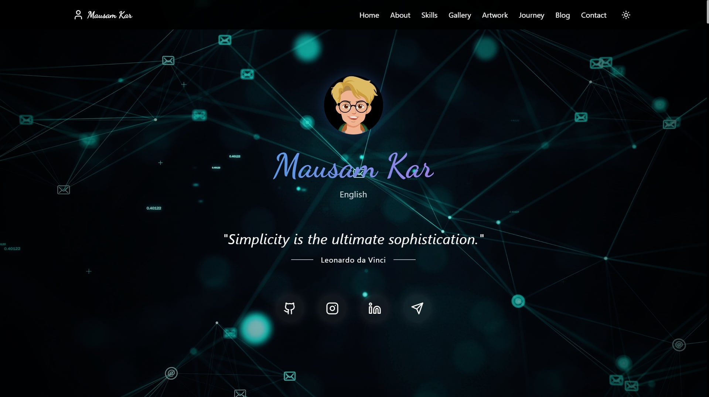

🚀 My Portfolio (Version 3)

🌟 Introduction
Welcome to Version 3 of my personal portfolio! This is the most animated, interactive, and visually dynamic version yet. It features a modern, sleek UI, smooth animations, and a fully responsive design, ensuring a seamless experience across all devices. With both dark mode and light mode, users can enjoy a comfortable viewing experience tailored to their preference.

🛠️ Tech Stack

My portfolio is built using cutting-edge technologies to ensure optimal performance, smooth interactivity, and a captivating user experience:

Frontend: ReactJS, TypeScript, JavaScript
Styling: Custom CSS, Advanced Animations
Deployment: Vercel for high-speed global access
Other Integrations: Telegram for direct communication
📂 Sections Included
This portfolio showcases multiple sections, each designed to highlight my skills, achievements, experiences, and personal journey:

✅ Hero Section – A captivating introduction with animations

✅ About Me Section – My story, passions, and interests

✅ Qualification Section – A breakdown of my qualifications and expertise

✅ Certification Section – A showcase of my earned certificates

✅ Skills Section – A visually interactive display of my technical skills

✅ Education Section – A detailed timeline of my academic journey

✅ Notes Section – A place where I share key learnings and thoughts

✅ Gallery Section – A collection of my favorite memories and creative captures

✅ Artwork Section – My artistic creations and paintings

✅ Journey Section – A step-by-step timeline of my personal and professional growth

✅ Inspirations Section – A section dedicated to my mentors and sources of motivation

✅ Future Goals Section – My aspirations and ambitions in the tech industry

✅ Fun Facts About Me Section – Some interesting things about me!

✅ Blog Section – My articles, insights, and experiences

✅ Testimonial Section – Feedback and appreciation from peers and colleagues

✅ Contact Section – Ways to connect and collaborate

🚀 Live Demo

🌐 Explore the portfolio now: https://my-portfolio-v-03.vercel.app/

🔗 My Portfolio (V3):

🔗 Alternate Link:

🔧 Installation & Setup

Want to explore or contribute to my portfolio? Follow these steps:

1️⃣ Clone the repository: git clone https://github.com/your-username/your-repo-name.git  
cd your-repo-name  

2️⃣ Install dependencies: npm install  

3️⃣ Start the development servr : npm run dev  

📬 Contact Me

Feel free to reach out to me through any of these platforms:

🔹 GitHub → https://github.com/Mausam5055/

🔹 LinkedIn → https://www.linkedin.com/in/mausam-kar-6388861a7/

Let’s connect and collaborate on exciting projects! 🚀🎯

